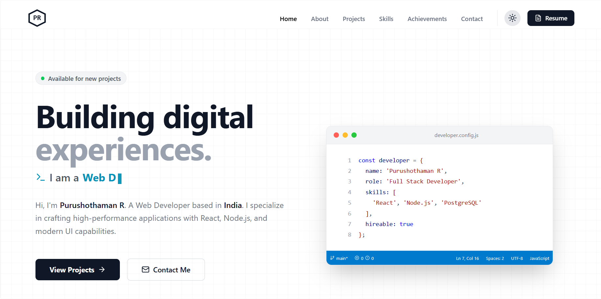

# Portfolio 2.0 | Purushothaman R



> A premium, high-performance developer portfolio built with React 19, Tailwind CSS v4, and Framer Motion. Designed with a distinct "Developer/Hacker" aesthetic featuring a VS Code-style hero section, system diagnostics dashboard, and interactive terminal.

## 🚀 Key Features

*   **Modern Tech Stack**: Built on the latest ecosystem (React 19, Vite, Tailwind v4).
*   **Developer Aesthetic**:
    *   **Hero Section**: Interactive VS Code simulation with typing effects.
    *   **Footer**: "System Status Bar" mimicking a code editor environment.
    *   **Projects**: Terminal-window styled cards with command-line visuals.
    *   **Skills**: "System Diagnostics" dashboard with uptime and memory stats.
*   **🖥️ Interactive CLI**: A hidden "Hacker Mode" terminal.
    *   Press `Ctrl+K` or `~` (Tilde) to open.
    *   Execute commands like `help`, `about`, `projects`, `ls`.
*   **📱 PWA Support**: Fully installable as a native-like app with offline capabilities.
*   **Secure Contact Form**: Integrated with **EmailJS** featuring a "Secure Transmission" UI.
*   **Animations**: Smooth page transitions and entry effects using `framer-motion`.
*   **Responsive**: Fully optimized for mobile, tablet, and desktop screens.
*   **SEO Optimized**: Includes Open Graph tags, Twitter Cards, and semantic metadata.

## 🛠️ Tech Stack

*   **Core**: [React 19](https://react.dev/) + [TypeScript](https://www.typescriptlang.org/)
*   **Build Tool**: [Vite](https://vitejs.dev/)
*   **Styling**: [Tailwind CSS v4](https://tailwindcss.com/)
*   **PWA**: [Vite Plugin PWA](https://vite-pwa-org.netlify.app/)
*   **Icons**: [Lucide React](https://lucide.dev/)
*   **Animations**: [Framer Motion](https://www.framer.com/motion/)
*   **Email Service**: [EmailJS](https://www.emailjs.com/)

## 📦 Getting Started

### Prerequisites

*   Node.js (v18 or higher)
*   npm or yarn

### Installation

1.  **Clone the repository**
    ```bash
    git clone https://github.com/purushothaman-web/portfolio-2.0.git
    cd portfolio-2.0
    ```

2.  **Install dependencies**
    ```bash
    npm install
    ```

3.  **Configure Environment Variables**
    *   Copy the example environment file:
        ```bash
        cp .env.example .env
        ```
    *   Open `.env` and add your **EmailJS** credentials:
        ```env
        VITE_EMAILJS_SERVICE_ID=your_service_id
        VITE_EMAILJS_TEMPLATE_ID=your_template_id
        VITE_EMAILJS_PUBLIC_KEY=your_public_key
        ```

4.  **Run Development Server**
    ```bash
    npm run dev
    ```

## 🌐 Deployment

This project is optimized for deployment on **Vercel** or **Netlify**.

1.  Connect your GitHub repository.
2.  Add your Environment Variables in the platform's settings.
3.  Deploy!

## 📄 License

Distributed under the MIT License. See `LICENSE` for more information.

## 📬 Contact

**Purushothaman R** - [rpurushothaman500@gmail.com](mailto:rpurushothaman500@gmail.com)

Project Link: [https://github.com/purushothaman-web/portfolio-2.0](https://github.com/purushothaman-web/portfolio-2.0)
